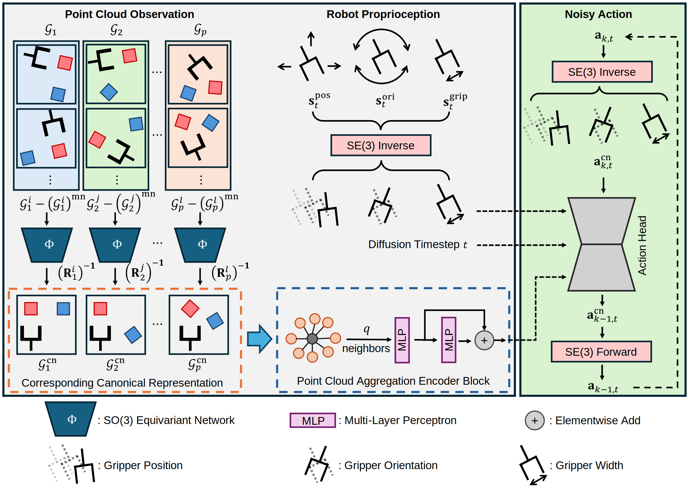

# Canonical Policy
[Project Website](https://zhangzhiyuanzhang.github.io/cp-website/) |
[Paper](https://arxiv.org/abs/2505.18474) |
[Video](https://drive.google.com/file/d/1fKU6Cs5frtCxBv3SxwQF2hUcB0vKy1US/view)  
<a href="https://zhangzhiyuanzhang.github.io/personal_website/">Zhiyuan Zhang*</a><sup>1</sup>, 
<a href="https://zhengtongxu.github.io/website/">Zhengtong Xu*</a><sup>1</sup>, 
<a href="">Jai Nanda Lakamsani</a><sup>1</sup>, 
<a href="https://www.purduemars.com/">Yu She</a><sup>1</sup>  

<sup>1</sup> Purdue University, <sup>*</sup> Equal Contribution

 | 
## Installation
1.  Install the following apt packages for mujoco:
    ```bash
    sudo apt install -y libosmesa6-dev libgl1-mesa-glx libglfw3 patchelf
    ```

1. Install [Mambaforge](https://github.com/conda-forge/miniforge#mambaforge) (strongly recommended) or Anaconda
1. Clone this repo
    ```bash
    git clone https://github.com/ZhangZhiyuanZhang/canonical_policy
    cd canonical_policy
    ```
1. Install environment:
    Use Mambaforge (strongly recommended):
    ```bash
    mamba env create -f conda_environment.yaml
    conda activate cp
    ```
    or use Anaconda (not recommended): 
    ```bash
    conda env create -f conda_environment.yaml
    conda activate cp
    ```
1. Install mimicgen:
    ```bash
    mkdir third_party
    cd third_party
    git clone https://github.com/NVlabs/mimicgen_environments.git
    cd mimicgen_environments
    # This project was developed with Mimicgen v0.1.0. The latest version should work fine, but it is not tested
    git checkout 081f7dbbe5fff17b28c67ce8ec87c371f32526a9
    pip install -e .
    cd ../..
    ```
1. Make sure mujoco version is 2.3.2 (required by mimicgen)
    ```bash
    pip list | grep mujoco
    ```

<div style="background-color:white; display:inline-block; padding:5px;">
  
</div>


## Quick Guide: Canonical Representation of Equivariant Groups
### Import Required Modules
```bash
import torch
from canonical_policy.model.vision.canonical_utils.utils import construct_rotation_matrix
from canonical_policy.model.vision.canonical_utils.vec_pointnet import VecPointNet, VN_Regressor

# encapulate the rotation matrix estimation
def get_canonical_rot(input_pcl, extractor, predictor):
    """
    input_pcl: [B, N, 3]
    """
    equiv_feat = extractor(input_pcl)   # [B, D, 3, N] mean pooling -> [B, D, 3]
    v1, v2 = predictor(equiv_feat)  # [B, 3], [B, 3]
    rot = construct_rotation_matrix(v1, v2)  # [B, 3, 3]
    return rot

# generate random SO3 rotation matrix
def random_rotation_matrix():
    q = torch.randn(4)
    q = q / q.norm()
    qw, qx, qy, qz = q
    return torch.tensor([
        [1 - 2*qy**2 - 2*qz**2, 2*qx*qy - 2*qz*qw,     2*qx*qz + 2*qy*qw],
        [2*qx*qy + 2*qz*qw,     1 - 2*qx**2 - 2*qz**2, 2*qy*qz - 2*qx*qw],
        [2*qx*qz - 2*qy*qw,     2*qy*qz + 2*qx*qw,     1 - 2*qx**2 - 2*qy**2]
    ])

# SO3-equivariant model
extractor = VecPointNet(h_dim=32, c_dim=32, num_layers=2, knn=5)
predictor = VN_Regressor(pc_feat_dim=32)
```
### Generate Equivariant Group
```bash
# Generate random point cloud X ∈ ℝ^{N×3}
B = 1
N = 12
X = torch.rand(B, N, 3)

# X and Y are within the same equivariant group
R = random_rotation_matrix()
t = torch.randn(B, 1, 3)
Y = X @ R.T + t  # equal to (R @ X.T).T
```
### Transform elements of an equivariant group into a shared canonical representation
```bash
# 1. Point Cloud Decenterization
X_decentered = X - X.mean(dim=1, keepdim=True)   # [B, N, 3]
Y_decentered = Y - Y.mean(dim=1, keepdim=True)   # [B, N, 3]

# 2. Compute inverse rotation matrix for each element
rot_X = get_canonical_rot(X_decentered, extractor, predictor)  # [B, 3, 3]
rot_Y = get_canonical_rot(Y_decentered, extractor, predictor)  # [B, 3, 3]

# 3. Transform to canonical space
X_canonical = X_decentered @ rot_X  # equal to (R^(-1) @ X.T).T
Y_canonical = Y_decentered @ rot_Y  # equal to (R^(-1) @ X.T).T

# Print results
print("X_canonical:", X_canonical)
print("Y_canonical:", Y_canonical)
```

## Dataset
### Download Dataset
Download dataset from MimicGen's hugging face: https://huggingface.co/datasets/amandlek/mimicgen_datasets/tree/main/core  
Make sure the dataset is kept under `/path/to/canonical_policy/data/robomimic/datasets/[dataset]/[dataset].hdf5`

### Generating Voxel and Point Cloud Observation

```bash
# Template
python canonical_policy/scripts/dataset_states_to_obs.py --input data/robomimic/datasets/[dataset]/[dataset].hdf5 --output data/robomimic/datasets/[dataset]/[dataset]_voxel.hdf5 --num_workers=[n_worker]
# Replace [dataset] and [n_worker] with your choices.
# E.g., use 24 workers to generate point cloud and voxel observation for stack_d1 with 200 demos
python canonical_policy/scripts/dataset_states_to_obs.py --input data/robomimic/datasets/stack_d1/stack_d1.hdf5 --output data/robomimic/datasets/stack_d1/stack_d1_voxel.hdf5 --num_workers=24 --n=200
```

### Convert Action Space in Dataset
The downloaded dataset has a relative action space. To train with absolute action space, the dataset needs to be converted accordingly
```bash
# Template
python canonical_policy/scripts/robomimic_dataset_conversion.py -i data/robomimic/datasets/[dataset]/[dataset].hdf5 -o data/robomimic/datasets/[dataset]/[dataset]_abs.hdf5 -n [n_worker]
# Replace [dataset] and [n_worker] with your choices.
# E.g., convert stack_d1_voxel (voxel) with 12 workers
python canonical_policy/scripts/robomimic_dataset_conversion.py -i data/robomimic/datasets/stack_d1/stack_d1_voxel.hdf5 -o data/robomimic/datasets/stack_d1/stack_d1_voxel_abs.hdf5 -n 12
```

## Training with point cloud observation
To train Canonical Policy (with absolute pose control) in Stack D1 task:
```bash
# Make sure you have the voxel converted dataset with absolute action space from the previous step 
python train.py --config-name=train_canonical_diffusion_unet_abs task_name=stack_d1 n_demo=200
```

## License
This repository is released under the MIT license. See [LICENSE](LICENSE) for additional details.

## Acknowledgement
* Our repo is built upon the origional [Equivariant Diffusion Policy](https://github.com/pointW/canonical_policy)
* The Point Cloud Encoder is adapted from the original [PointMLP](https://github.com/ma-xu/pointMLP-pytorch)